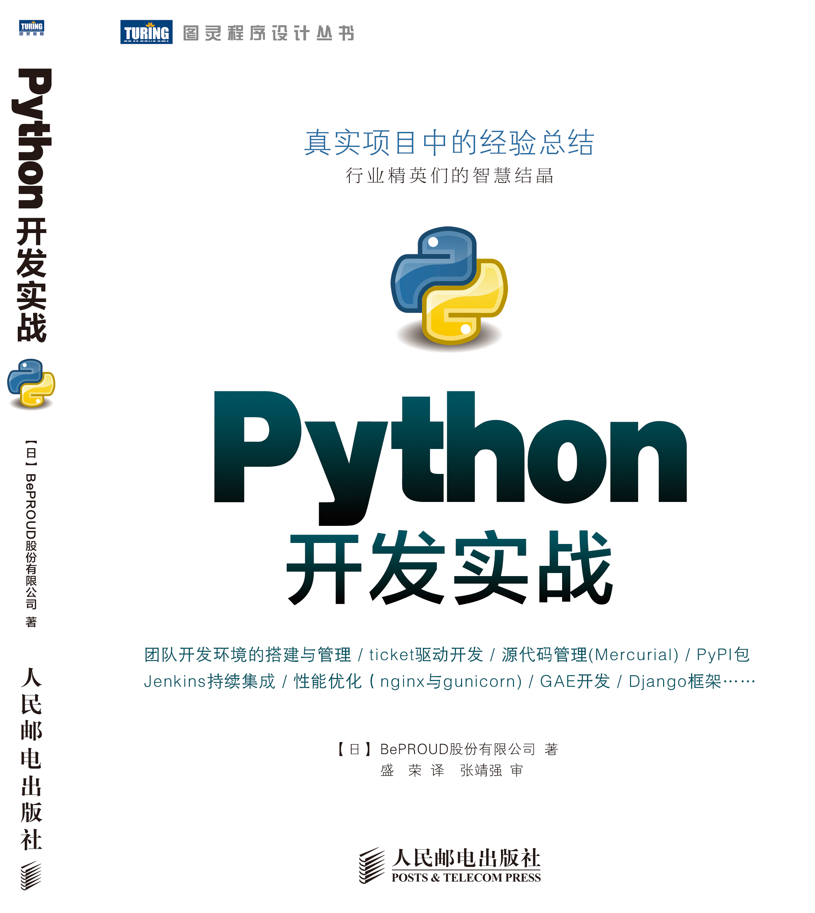

===========================================================
Python **2.5** からPython **3.3** で 動作するツールの作り方
===========================================================

.. ================================================================
.. Introduction
.. ================================================================
.. 5分

About Me
=========
.. figure:: images/face.png

http://about.me/shimizukawa

Activity

* Sphinx co-committer
* Sphinx-users.jp chairman
* PyCon JP 2011,2012 vice-chairman

.. s6:: effect slide

.. s6:: styles

    'div[0]': {width:'15%', position:'absolute', top:'0', right:'1em'},

Books
======

* エキスパートPythonプログラミング (和訳)

  .. figure:: images/book-epp.jpg

* Pythonプロフェッショナルプログラミング (2章分)

  .. figure:: images/book-pypro.png

.. s6:: styles

   'ul/li[0]/p': {width: '50%', marginBottom:'0.5em'},
   'ul/li[0]/div': {width:'30%', position:'absolute', left:'55%', top:'1em'},
   'ul/li[1]': {marginLeft: '2em'},
   'ul/li[1]/p': {width: '50%'},
   'ul/li[1]/div': {width:'30%', position:'absolute', right:'0', top:'4em'},
   'ul/li[1]/ul/li[0]': {display:'none'},
   'ul': {fontSize:'70%'},

.. s6:: actions

   ['ul/li[1]/ul/li', 'fade in', '0.3'],

中国語版
================

   10月に発売予定らしい

Sphinxをはじめよう
==================

.. figure:: images/book-learn-sphinx.jpg

   Sphinxをはじめよう

* 謎の動物
* 世界初のSphinx本
* オライリー・ジャパン
* 電子書籍
* 100P弱相当
* 1,680円
* **Now ON SALE !!**

.. s6:: styles

   'p': {width: '50%', marginBottom:'0.5em'},
   'div': {width:'40%', position:'absolute', left:'58%', top:'1em'},
   'ul': {marginLeft: '2em'},
   'ul': {width: '50%'},
   'ul': {width:'30%', position:'absolute', right:'0', top:'4em'},
   'ul': {fontSize:'70%'},

Abstract
=========

.. s6:: styles

   'h2': {textAlign:'center', margin:'30% auto', lineHeight:'1.5em'}

Abstract
=========

目的
  多数のPythonバージョンで動作するようにコードを書く

対象環境:
  Python2.5 - Python3.3 (3.0を除く)

題材:
  sphinx-intl

.. s6:: effect slide

.. s6:: styles

   'dl': {fontSize:'90%'},

.. ================================================================
.. What is sphinx-intl
.. ================================================================
.. 5分

What is sphinx-intl
====================

* Sphinxの国際化機能サポートツール

  * potから言語別poの生成、更新、ビルド
  * transifexサポート: potからtransifex設定ファイルの生成

.. figure:: images/translation.png

.. sphinx-intlがなんのためのツールかということを端的に説明したいが、この文面だと長い：「sphinx-users.jpで使用している手法について紹介します。この方法は、ドキュメントの更新があれば自動的にpoファイルを更新してくれるし、翻訳文を更新すれば自動的にサイトを更新してくれる全自動の手法です。この手法の中核にあるのがsphinx-intlです。」

.. s6:: effect slide

.. s6:: styles

   'ul[0]': {fontSize: '50%'},
   'div[0]': {width: '80%', margin:'0.1em auto'},

Motivation
===========

* Sphinx-1.2の対応バージョン

  * Python 2.5
  * Python 2.6
  * Python 2.7
  * Python 3.1
  * Python 3.2
  * Python 3.3

* sphinx-intlも同じバージョン対応が必要

.. s6:: effect slide

Detail of sphinx-intl 1
========================

sphinx-intlの行数:

* 本体: 577行 （docstring含む）
* ドキュメント: 229行 （README等）
* テスト: 500行 （ユーティリティ含む）

.. s6:: effect slide

Detail of sphinx-intl 2
========================

* sphinx-intlの構成::

     /
     ├─ README.rst
     ├─ setup.cfg
     ├─ setup.py
     ├─ tox.ini
     ├─ sphinx_intl/
     │   ├─ __init__.py (3L)
     │   ├─ __main__.py (5L)
     │   └─ commands.py (575L)
     └─ tests (497L)

.. s6:: effect slide

.. ================================================================
.. Difference from Python2.5 to Python 3.3
.. ================================================================
.. 15分

Differences from Python2.5 to Python 3.3
============================================

.. s6:: styles

   'h2': {textAlign:'center', margin:'30% auto', lineHeight:'1.5em'}

Differences from Python2.5 to Python 3.3
============================================

* ライブラリの違い
* 関数の違い
* 文法の違い

sphinx-intlが使っている範囲で紹介

.. speech:: ライブラリや関数の違いを吸収するのは簡単ですが、文法の違いを吸収するのは手間がかかります。どこが違って、どうやって吸収するのかについて、sphinx-intlが使用している範囲で紹介します。

.. s6:: effect slide

Python2か3かを見分ける
======================

バージョン判別フラグを用意して、以降のコードの書き分けに利用。

.. code-block:: pycon

   >>> PY2 = sys.version_info < (3, 0)
   >>> PY3 = not PY2
   >>> PY2
   True
   >>> PY3
   False

.. s6:: effect slide

ライブラリの違い
================

* optparse(まだある)とargparse(2.7以降, 3.2以降)
* OrderedDict(2.7から)

.. s6:: effect slide

optparseとargparse
====================

* optparse: 2.5から3.3の全てで使える
* でもoptparseはAPI設計が古いので不便
* argparseが使いやすい
* argparse: 2.7以降, 3.2以降

他のバージョン向けにPyPIで提供している:

.. code-block:: bash

   $ pip install argparse

.. s6:: effect slide

OrderedDict
============

* 辞書なのに追加した順序を維持してくれる
* 2.7から使える

他のバージョン向けにPyPIで提供している:

.. code-block:: bash

   $ pip install ordereddict

Pythonバージョン別で使い分ける:

.. code-block:: python

   if sys.version_info < (2, 7):
       from ordereddict import OrderedDict
   else:
       from collections import OrderedDict

.. s6:: effect slide

関数や属性の変更
=================

* unicodeとstrとbytes (2と3で異なる)
* func_code (2のみ)と__code__ (2.6以降)
* callable消滅 (3.0, 3.1のみ、3.2で復活)
* execfile消滅 (3.0以降)

.. s6:: effect slide

関数: unicodeとstrとbytes
==========================

* Python2の str() は Python3の bytes()
* Python2の unicode() は Python3の str()

.. .. todo:: 使い方の例が必要?

.. code-block:: python

   if PY2:
       def b(s):
           return s
       def u(s):
           return unicode(s, "unicode_escape")
   else:
       def b(s):
           return s.encode("latin-1")
       def u(s):
           return s

.. s6:: effect slide

.. s6:: styles

   'div': {fontSize:'70%'}

属性: func_codeと__code__
==========================

関数オブジェクトの属性。

.. code-block:: python

   def spam(name, age, kind=None):
       pass

関数の引数の数や変数名とか色々取れる。

.. code-block:: python

   if PY2:
       argcount = spam.func_code.co_argcount
       varnames = spam.func_code.co_varnames[:argcount]
   else:
       argcount = spam.__code__.co_argcount
       varnames = spam.__code__.co_varnames[:argcount]

.. s6:: effect slide

.. s6:: styles

   'div': {fontSize:'75%'}

関数: callable消滅
===================

* 3.0, 3.1で組み込み関数から消えた
* 3.2で復活した

.. code-block:: python

   try:
       callable = callable

   except NameError:
       def callable(obj):
           return any(
               "__call__" in klass.__dict__
               for klass in type(obj).__mro__
           )

.. s6:: styles

   'div': {fontSize:'85%'}

.. s6:: effect slide

関数: execfile消滅
==================

* 3.0で組み込み関数から消えた

.. code-block:: python

   try:
       execfile = execfile

   except NameError:
       def execfile(filepath, _globals):
           f = open(filepath, 'rt')
           source = f.read()
           code = compile(source, filepath, 'exec')
           exec(code, _globals)

execもPy3で文から式に変わりました。

.. s6:: styles

   'div': {fontSize:'80%'}

.. s6:: effect slide

文法の違い
==========

* with文
* print文とprint関数

.. s6:: effect slide

文法: with文
=============

* 2.5から__future__で提供、2.6から標準

.. code-block:: python

   from __future__ import with_statement

   with open('file.txt', 'r') as f:
      print f.read()

.. s6:: effect slide

文法: print文とprint関数1
==========================

Python2のprint文の例

.. code-block:: pycon

   >>> print 'spam', 'egg', 'ham'
   spam egg ham

Python2で括弧を付けるとタプルをprintしてしまう↓

.. code-block:: pycon

   >>> print('spam', 'egg', 'ham')
   ('spam', 'egg', 'ham')

Python3では普通にプリントされる

.. code-block:: pycon

   >>> print('spam', 'egg', 'ham')
   spam egg ham

.. s6:: styles

   'div': {fontSize:'70%'}

文法: print文とprint関数2
==========================

Python2系でのprint文の例:

.. code-block:: python

    print >>sys.stderr, 'image:', filename, 'loading...',
    data = load_image(filename)
    print('done.')

Python3系のprint関数だと:

.. code-block:: python

    print('image:', filename, 'loading...', end=' ', file=sys.stderr)
    data = load_image(filename)
    print('done.')

printを文ではなく式として解釈させる(2.5は非対応)

.. code-block:: python

   from __future__ import print_function

.. s6:: effect slide

.. s6:: styles

   'div': {fontSize:'65%'},
   'p': {fontSize:'65%', margin: '0.5em'},

文法: print関数実装例
==========================

print関数は仕様が多いので、互換機能実装はとても面倒

.. code-block:: python

   def print_(*args, **kwargs):
       fp = kwargs.pop("file", sys.stdout)
       if fp is None:
           return
       def write(data):
           if not isinstance(data, basestring):
               data = str(data)
           fp.write(data)
       want_unicode = False
       sep = kwargs.pop("sep", None)
       if sep is not None:
           if isinstance(sep, unicode):
               want_unicode = True
           elif not isinstance(sep, str):
               raise TypeError("sep must be None or a string")
       end = kwargs.pop("end", None)
       if end is not None:
           if isinstance(end, unicode):
               want_unicode = True
           elif not isinstance(end, str):
               raise TypeError("end must be None or a string")
       if kwargs:
           raise TypeError("invalid keyword arguments to print()")
       if not want_unicode:
           for arg in args:
               if isinstance(arg, unicode):
                   want_unicode = True
                   break
       if want_unicode:
           newline = unicode("\n")
           space = unicode(" ")
       else:
           newline = "\n"
           space = " "
       if sep is None:
           sep = space
       if end is None:
           end = newline
       for i, arg in enumerate(args):
           if i:
               write(sep)
           write(arg)
       write(end)

.. **

.. s6:: effect slide

.. s6:: styles

   'div': {fontSize:'60%'},
   'p': {fontSize:'60%', margin: '0.5em'},

ここまでのまとめ
=================

Python2と3両対応コード書くのって、大変

.. s6:: styles

   'p': {fontSize:'160%', margin: '1em 0.5em', textAlign: 'center'},

.. ================================================================
.. How to keep compatibility with both python2 and 3
.. ================================================================
.. 20分

How to keep compatibility with both python2 and 3
==================================================

.. speech:: 2to3を使ってコード変換する方法と、sixを使って共通コードで動作させる方法があります。一長一短ありますが、どのようなときにどちらを使うべきかなど紹介します。

.. s6:: styles

   'h2': {textAlign:'center', margin:'30% auto', lineHeight:'1.5em'}

.. s6:: effect slide

How to keep compatibility with both python2 and 3
==================================================

方法が3つくらい

* 2to3を使う
* 両対応コードを書く
* sixを使う

.. s6:: effect slide

2to3を使う
===========

* Python3にはlib2to3がある
* Python2のコードをPython3に変換する
* 1年ちょっと前のコードは2to3利用が多かった

.. s6:: effect slide

2to3を使う - Pros
==================

Pros

* Python2のコード資産を生かしてすぐPython3対応
* setuptoolsはsetup(2to3=True)でインストール時変換

.. s6:: effect slide

2to3を使う - Cons
==================

Cons

* 2to3は遅い
* テスト実行のために毎回2to3が必要
* Python3でだけエラーがある場合、変換後のコードで問題があると面倒

  * どう変換されるか予測してPython2のコードを書く必要がある

.. s6:: effect slide

両対応コードを書く
==========================

2to3を使わず、両方で解釈できる方法で書く。

自力で、がんばる……

.. code-block:: python

   def print_(*args, **kwargs):
       fp = kwargs.pop("file", sys.stdout)
       if fp is None:
           return
       def write(data):
           if not isinstance(data, basestring):
               data = str(data)
           fp.write(data)
       want_unicode = False
       sep = kwargs.pop("sep", None)
       if sep is not None:
           if isinstance(sep, unicode):
               want_unicode = True
           elif not isinstance(sep, str):
               raise TypeError("sep must be None or a string")
       end = kwargs.pop("end", None)
       if end is not None:
           if isinstance(end, unicode):
               want_unicode = True
           elif not isinstance(end, str):
               raise TypeError("end must be None or a string")
       if kwargs:
           raise TypeError("invalid keyword arguments to print()")
       if not want_unicode:
           for arg in args:
               if isinstance(arg, unicode):
                   want_unicode = True
                   break
       if want_unicode:
           newline = unicode("\n")
           space = unicode(" ")
       else:
           newline = "\n"
           space = " "
       if sep is None:
           sep = space
       if end is None:
           end = newline
       for i, arg in enumerate(args):
           if i:
               write(sep)
           write(arg)
       write(end)

.. **

.. s6:: effect slide

.. s6:: styles

   'p[0]': {fontSize:'75%'},
   'p[1]': {display:'none', fontSize:'75%'},
   'div[0]': {display:'none', fontSize:'60%'},

.. s6:: actions

   ['p[1]', 'fade in', '0.3'],
   ['div[0]', 'fade in', '0.3'],

両対応コードを書く - Pros
==========================

Pros

* 2to3の問題点が発生しない！

  * 変換しなくてよい
  * デバッグしやすい - **重要**

* Python2.6以降なら大体Python3互換の書き方ができる

.. s6:: effect slide

両対応コードを書く - Cons
==========================

Cons

* Python2.4対応は絶望的（可能だけど）
* Python2.5を投げ捨てたくなる
* 差異の吸収を自分でやる手間がかかる

.. s6:: effect slide

.. s6:: styles

   'ul/li[0]': {display:'none'},
   'ul/li[1]': {display:'none'},
   'ul/li[2]': {display:'none'},

.. s6:: actions

   ['ul/li[0]', 'fade in', '0.3'],
   ['ul/li[1]', 'fade in', '0.3'],
   ['ul/li[2]', 'fade in', '0.3'],

sphinx-intlはどうしたか？
==========================

* 最初は自力で両対応コードを書いていた
* エクササイズのつもりだった
* printとexecの互換実装が大変だった
* 諦めてsixを導入

.. s6:: effect slide

six
=====

six_ (1.4.1 release  2013/9/2)

* Python2.4から3.3まで対応
* 移動したり名前が変わったり消えたり増えたりしたパッケージ、モジュールの互換レイヤ
* 移動や名前変更は内部でバージョン判別して呼び直している（movesパッケージ）
* 消えたり増えたりは、同一機能を提供

.. _six: https://pypi.python.org/pypi/six

.. s6:: effect slide

.. s6:: styles

   'ul/li': {fontSize: '80%'},

避けられない自力対応
====================

* sixでも提供されていないものは自力で対応

  * execfile
  * 他にもあるかも?

.. s6:: effect slide

避けられない2to3 (conf.py)
===========================

* sphinx-intlはSphinxのconf.pyを読んでいる(locale等の設定を見るため)
* conf.pyはユーザーが書くので、Python2か3か分からない
* 読み込めたらそのまま使う、だめなら2to3で変換してもう一度読み込む

こういうこともあるんだね

.. s6:: effect slide

.. ================================================================
.. パッケージングにおける課題
.. ================================================================
.. 10分

パッケージングにおける課題
==========================

.. speech:: 2013/7/1現在、Pythonのパッケージングは混乱しています。とりあえず今どうすると安定したパッケージ供給が出来るのか紹介します。

.. s6:: styles

   'h2': {textAlign:'center', margin:'30% auto', lineHeight:'1.5em'}

.. s6:: effect slide

パッケージングにおける課題
==========================

* パッケージングツールの変遷
* setuptoolsを使うか、使わないか
* Python2と3で動作するsetup.pyを作る

.. s6:: effect slide

パッケージングツールの変遷
===================================

ここまでがPyCon JP 2011の頃。

1. Python標準はdistutils、色々足りないしeasy_install的なのが無い
2. setuptoolsがeasy_installを提供
3. pipはeasy_installより便利なコマンドを提供
4. setuptoolsをPython3対応させたdistributeがデファクトに

.. s6:: effect slide

2012年
======

これがPyCon JP 2012の前後。

* setuptoolsはもう更新されてないから ``distribute`` 使おう！
* Python3.3で提供される ``packaging`` を使おう！
* packagingがPython3.3リリース直前に消滅

.. s6:: effect slide

2013年
======

PyCon APAC 2013の頃

* ``distlib`` 登場。packagingで不足していた下位レイヤ。Python3.4同梱予定。
* ``wheel`` 登場。eggに代わるPython標準のバイナリ形式。distlibと合流。
* ``distribute`` 廃止！ ``setuptools`` に統合。setuptoolsがPython3対応に！

**setuptoolsを使おう！** （distlibの世界になるまでは）

詳しくは `PyCon APAC 2013 DAY1, パッケージングの今と未来`_ の発表を参照

.. _PyCon APAC 2013 DAY1, パッケージングの今と未来: session-14-1110-rooma0715-ja1-ja

.. s6:: effect slide

.. s6:: styles

   'p': {fontSize: '60%'},
   'ul/li': {fontSize: '90%'},

Python2と3で動作するsetup.pyを作る
===================================

* setup.pyはPython2,3互換コードで書く
* 特定バージョンの場合だけ依存パッケージをインストールする
* 特定バージョンの場合、依存パッケージのバージョンを指定する

.. s6:: effect slide

setup.pyはPython2,3互換コードで書く
====================================

* 2to3は使えない
* setup.pyは自力でがんばって互換性を維持しよう

.. s6:: effect slide

特定バージョンの場合だけ依存パッケージをインストールする
=========================================================

.. code-block:: python

   requires = ['six', 'polib', 'sphinx']

   if sys.version_info < (2, 7):
       requires.append('ordereddict')

.. s6:: effect slide

特定バージョンの場合、依存パッケージのバージョンを指定する
===========================================================

.. code-block:: python

   extras = {}

   if sys.version_info < (2, 6):
       extras['transifex'] = ['transifex_client==0.8']
   else:
       extras['transifex'] = ['transifex_client']

.. s6:: effect slide

.. s6:: styles

   'div': {fontSize: '75%'},

対応しているバージョンは書こう
==============================

.. code-block:: python

   setup(
       ...
       classifiers=[
           "Development Status :: 4 - Beta",
           "Environment :: Other Environment",
           "License :: OSI Approved :: BSD License",
           "Topic :: Documentation",
           "Topic :: Software Development :: Documentation",
           "Topic :: Text Processing :: General",
           "Topic :: Utilities",
           "Programming Language :: Python",
           "Programming Language :: Python :: 2",
           "Programming Language :: Python :: 2.5",
           "Programming Language :: Python :: 2.6",
           "Programming Language :: Python :: 2.7",
           "Programming Language :: Python :: 3",
           "Programming Language :: Python :: 3.1",
           "Programming Language :: Python :: 3.2",
           "Programming Language :: Python :: 3.3",
       ],
       ...
   )

PyPIでこう表示される: sphinx-intl_

.. _sphinx-intl: https://pypi.python.org/pypi/sphinx-intl

.. s6:: effect slide

.. s6:: styles

   'div': {fontSize: '50%'},

まとめ
=======

.. s6:: styles

   'h2': {textAlign:'center', margin:'30% auto', lineHeight:'1.5em'}

.. s6:: effect slide

まとめ
=======

* Python2.5はそろそろ消滅すべき
* 2to3はデバッグ大変
* six 便利
* 「Sphinxをはじめよう」売れ行き好調

  .. figure:: images/book-learn-sphinx.jpg
     :align: right

.. s6:: styles

   'ul/li[0]': {display:'none'},
   'ul/li[1]': {display:'none'},
   'ul/li[2]': {display:'none'},
   'ul/li[3]': {display:'none'},
   'ul/li[3]/div': {width:'25%'},

.. s6:: actions

   ['ul/li[0]', 'fade in', '0.3'],
   ['ul/li[1]', 'fade in', '0.3'],
   ['ul/li[2]', 'fade in', '0.3'],
   ['ul/li[3]', 'fade in', '0.3'],

ご清聴ありがとうございました
=============================

.. s6:: styles

   'h2': {textAlign:'center', fontSize:'110%', margin:'30% auto', lineHeight:'1.5em', background:'none'}

.. s6:: effect slide

